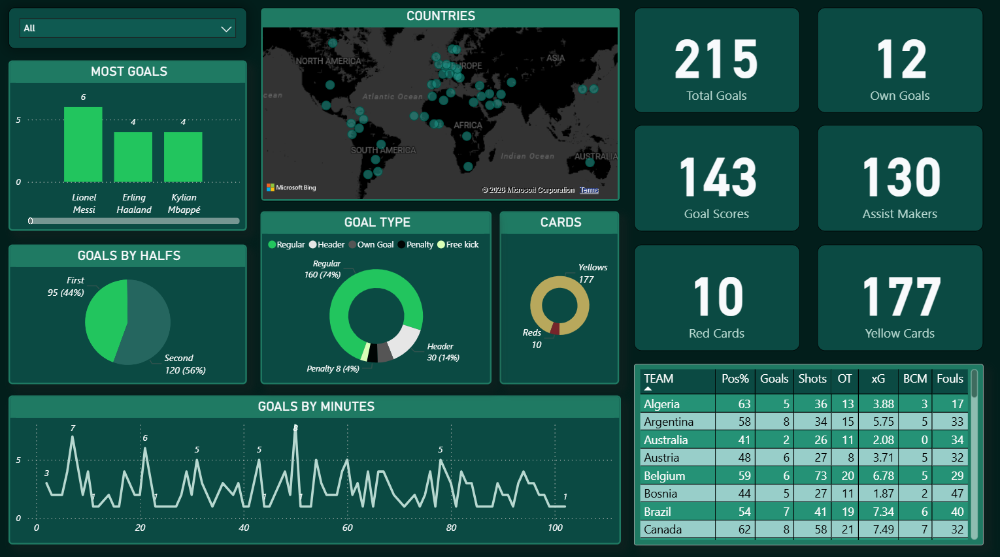
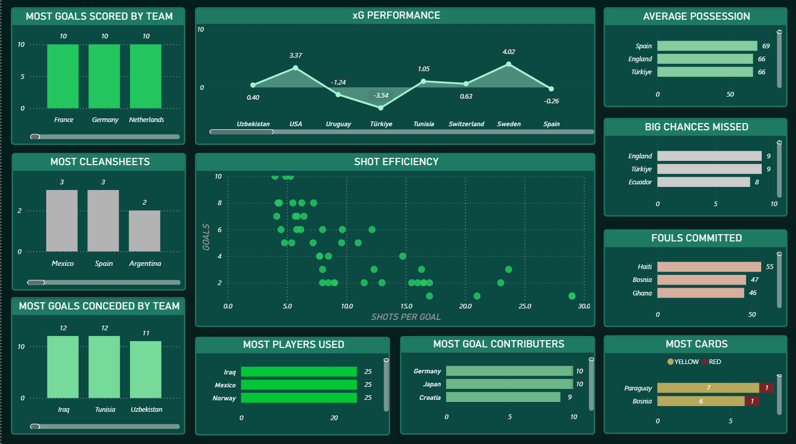
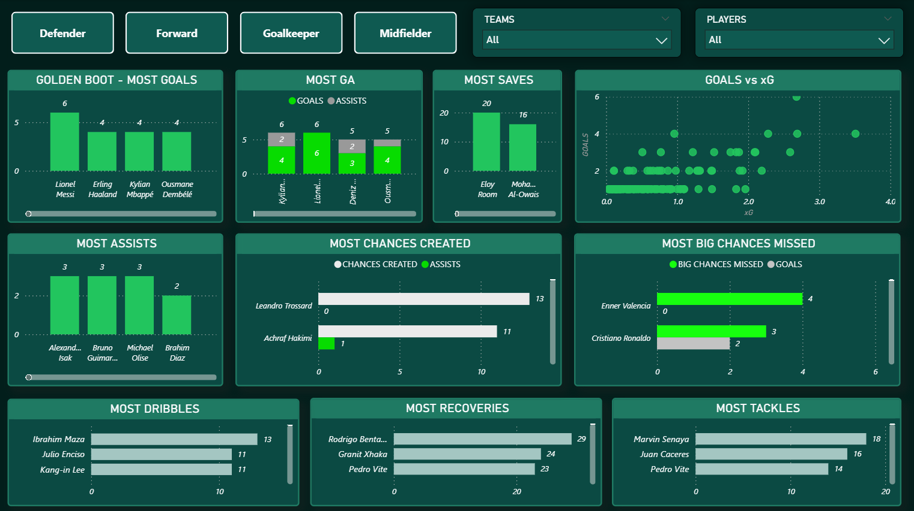
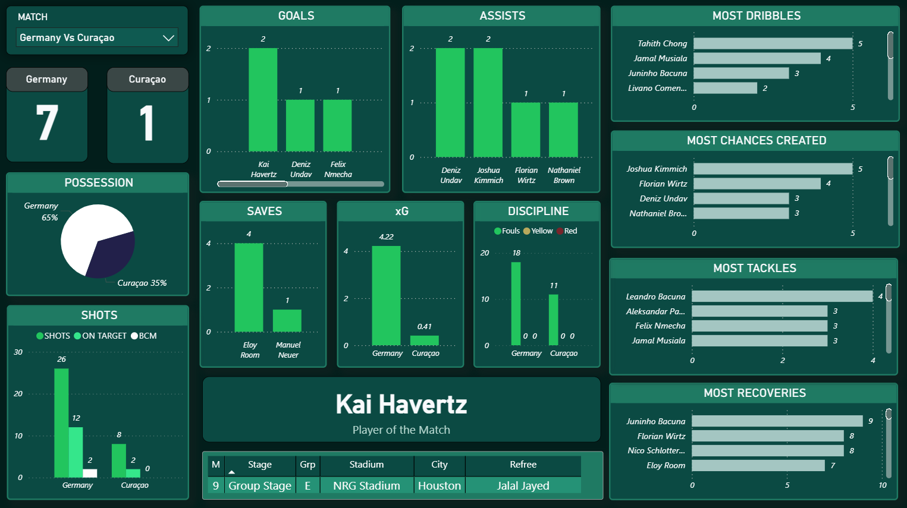
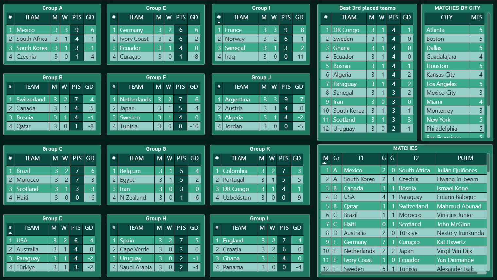

# FIFA World Cup 2026 Analytics Dashboard

An end-to-end sports analytics project that recreates the FIFA World Cup 2026 using a custom-built relational database, SQL analytics, Python data processing, and interactive Power BI dashboards.

Unlike traditional dashboard projects that rely on pre-built datasets, this project was developed entirely from scratch. Every match, player, goal, card, and statistical record is structured into a normalized MySQL database before being transformed into analytical dashboards.

The repository is actively maintained throughout the FIFA World Cup 2026, with new matches and statistics added as the tournament progresses.

---

## Project Highlights

- Designed and implemented a normalized MySQL database from scratch.
- Stored tournament data across multiple relational tables.
- Built SQL queries to automate player, team, and tournament statistics.
- Implemented FIFA 2026 Group Stage standings using official tie-break rules.
- Exported structured data using Python and Pandas.
- Developed an interactive multi-page Power BI dashboard.
- Automated statistical calculations using SQL and DAX.
- Continuously updated throughout the tournament.

---

## Objectives

The project was developed with the following objectives:

- Design a complete football analytics database.
- Demonstrate relational database modelling.
- Build automated tournament statistics.
- Analyse team and player performances.
- Visualize football data using Power BI.
- Create a portfolio-quality end-to-end analytics project.
- Maintain a live tournament analytics platform throughout FIFA World Cup 2026.

---

# Project Workflow

Unlike most dashboard projects, this repository follows a complete data engineering pipeline.

### Step 1 — Data Collection

Raw player and match statistics are collected from **FotMob** after every completed match.

These include:

- Match Results
- Goals
- Cards
- Team Statistics
- Player Attack Statistics
- Player Defence Statistics
- Expected Goals (xG)
- Possession

---

### Step 2 — Database Creation

A normalized relational database was designed in MySQL to organize tournament data efficiently.

The database stores the raw tournament data collected after every match, including:

- Teams
- Players
- Venues
- Matches
- Goals
- Yellow Cards
- Red Cards
- Match Statistics (team performance for every individual match)
- Attack Statistics (player attacking performance for every individual match)
- Defence Statistics (player defensive performance for every individual match)

Rather than storing cumulative statistics manually, the database uses SQL scripts to generate aggregated analytical tables from the match-level data.

The complete database schema and SQL scripts are available in the **DATABASE SCRIPTS** folder.

---

### Step 3 — Statistical Processing

Once the match-level data is stored, SQL is used to transform it into season-level analytical datasets.

Instead of manually maintaining cumulative statistics, SQL queries aggregate individual match records to generate higher-level tables used throughout the dashboard.

Examples include:

- **Team Statistics** – Generated by aggregating data from the **Match Statistics** table to calculate overall tournament performance for each team, including goals, possession, shots, passing accuracy, clean sheets, discipline, and other metrics.

- **Player Statistics** – Generated by combining and aggregating data from the **Attack Statistics** and **Defence Statistics** tables, producing tournament-wide performance metrics such as goals, assists, xG, chances created, tackles, recoveries, and goalkeeper saves.

- **Group Standings** – Automatically calculated from the **Matches** table using FIFA World Cup tie-break rules.

By generating these analytical datasets through SQL rather than storing duplicate information, the database remains normalized, minimizes redundancy, and ensures that every dashboard update reflects the latest match data automatically.

---

### Step 4 — Data Preparation

Before loading the data into Power BI, SQL views and aggregated tables are generated within MySQL to produce tournament-level statistics.

These processed datasets include team statistics, player statistics, standings, rankings, and other analytical tables that are derived from the underlying match-level data.

This preprocessing ensures that complex calculations are handled within the database, keeping the Power BI model efficient and easier to maintain.

---

### Step 5 — Dashboard Development

The Power BI dashboard is connected directly to the MySQL database using **Import Mode**, allowing the latest processed data to be loaded into the data model while maintaining high report performance.

Once imported, the data is transformed into an interactive analytics platform through a combination of Power Query and DAX. The dashboard includes advanced visualizations, dynamic filters, KPIs, and custom analytical measures.

This approach separates data engineering from visualization, with MySQL handling data storage and statistical processing, while Power BI focuses on exploration, analysis, and storytelling.

# Tournament Overview



The Tournament Overview page provides a complete summary of the competition.

It includes tournament-wide KPIs such as:

- Total Goals
- Goal Scorers
- Assist Providers
- Yellow Cards
- Red Cards
- Goal Distribution
- Goal Types
- Goal Timings
- Geographic Distribution of Participating Nations

This page serves as the landing page for the dashboard and provides a quick overview of the tournament's progress.

---

# Team Analysis



The Team Analysis page compares every participating nation using advanced football metrics.

Key analyses include:

- Goals Scored
- Goals Conceded
- Expected Goals (xG)
- Average Possession
- Shot Efficiency
- Clean Sheets
- Big Chances Missed
- Fouls Committed
- Goal Contributions
- Most Players Used

The page enables users to compare attacking efficiency, defensive stability, and overall team performance.

---

# Player Analysis



The Player Analysis page focuses on individual performances throughout the tournament.

Users can explore:

- Goals
- Assists
- Goal Contributions
- Expected Goals (xG)
- Chances Created
- Successful Dribbles
- Tackles
- Recoveries
- Goalkeeper Saves

Interactive filters allow users to analyse players by position and nationality.

---

# Match Analysis



The Match Analysis page provides a detailed breakdown of every fixture played during the tournament.

Users can select any match to analyse individual team and player performances.

The dashboard includes:

- Match Score
- Possession Comparison
- Goals
- Assists
- Expected Goals (xG)
- Goalkeeper Saves
- Shots, Shots on Target & Big Chances Missed
- Discipline (Yellow & Red Cards)
- Top Dribblers
- Chances Created
- Tackles
- Recoveries
- Player of the Match
- Match Information
  - Stadium
  - City
  - Referee
  - Tournament Stage
  - Group

This page allows users to understand how a match unfolded beyond the final scoreline.

---

# Group Stage Standings



The Group Stage dashboard automatically generates standings using official FIFA World Cup tie-break rules.

Every table updates dynamically as new match results are added to the database.

Implemented features include:

- Wins
- Draws
- Losses
- Goals For
- Goals Against
- Goal Difference
- Points
- Best Third-Placed Teams
- Match Schedule

Standings are generated directly through SQL, ensuring that every update is reflected automatically in Power BI.

---

# Database Design

Unlike most dashboard projects that rely on a single spreadsheet, this project uses a fully normalized relational database built in MySQL.

The database consists of multiple interconnected tables that model every major aspect of the tournament.

## Database Tables

| Table | Description |
|---------|-------------|
| Teams | Participating nations |
| Players | Complete player information |
| Venues | Stadiums and cities |
| Matches | Match details and results |
| Goals | Every goal scored in the tournament |
| Match Stats | Team statistics for each match |
| Team Stats | Tournament-wide team statistics |
| Player Stats | Combined player statistics |
| Attack Stats | Individual attacking metrics |
| Defence Stats | Individual defensive metrics |
| Yellow Cards | Tournament yellow card records |
| Red Cards | Tournament red card records |

The complete SQL implementation is available inside the **DATABASE SCRIPTS** folder.

---

# SQL Implementation

SQL is responsible for generating nearly all analytical datasets used throughout the dashboard.

Rather than relying on Power BI for heavy calculations, statistical processing is performed inside MySQL before visualization.

The project includes dedicated SQL scripts for:

### tables.sql

Creates the complete relational database including:

- Primary Keys
- Foreign Keys
- Relationships
- Constraints

---

### stats.sql

Generates:

- Team Statistics
- Player Statistics
- Goals
- Assists
- Goal Contributions

---

### standings.sql

Implements FIFA World Cup Group Stage standings.

The logic includes:

- Points
- Goal Difference
- Goals Scored
- Fair Play Rules

Standings update automatically whenever new matches are inserted into the database.

---

### detailedstats.sql

Creates detailed statistical views used for Power BI visualizations.

Examples include:

- Match Statistics
- Team Tournament Statistics(view)
- Individual Attack Statistics
- Individual Defence Statistics
- Players Tournament Statistics(view)

---

### triggers.sql

The project implements MySQL triggers to enforce data validation rules and maintain the integrity of tournament data. These triggers automatically validate records before they are inserted into the database, preventing invalid or inconsistent data from being stored.

The implemented triggers include:

- **invalidMATCH**
  - Prevents a match from being created where the home team and away team are the same.
  - Ensures only valid fixtures are stored in the database.

- **invalidgoal**
  - Validates the recorded goal minute.
  - Rejects any goal event where the minute is less than 1, preventing invalid match events.

- **penalty**
  - Enforces football rules by preventing penalty goals from having an associated assist.
  - Ensures penalty events are recorded accurately.

- **assist**
  - Prevents a player from assisting their own goal.
  - Ensures goal and assist records remain logically consistent.

These validation triggers help maintain data integrity by enforcing business rules directly at the database level, reducing the possibility of erroneous or inconsistent records entering the analytical database.

---

# Data Engineering

The project follows an end-to-end analytics workflow.

```

FotMob Statistics

↓

AI-assisted SQL Generation

↓

MySQL Database

↓

SQL Analytics

↓

Power BI Dashboard

```

Although AI-assisted prompts were used to generate repetitive SQL INSERT statements, every generated record was manually verified before being imported into the database.

This significantly reduced manual data-entry while maintaining data consistency.

---

# Power BI Features

The Power BI dashboard was designed to provide an intuitive and interactive experience while exploring tournament data. Rather than displaying static reports, each page enables users to filter, compare, and drill into specific teams, players, and matches.

Key Power BI features include:

- Interactive slicers and filters
- Dynamic rankings
- KPI cards
- Drill-through pages
- Cross-filtering between visuals
- Dynamic titles
- Custom DAX measures
- Responsive dashboard layout

These features allow users to transition seamlessly from tournament-level insights to detailed player and match analysis.

---

# Technologies Used

| Technology | Purpose |
|------------|---------|
| MySQL | Relational database management |
| SQL | Database creation, analytics, and automation |
| Python | Data export and automation |
| Pandas | Exporting MySQL tables to CSV |
| MySQL Connector | Database connectivity |
| Power BI | Dashboard development and visualization |
| DAX | Custom analytical calculations |
| GitHub | Project hosting and documentation |

---

# Key Analytical Capabilities

The dashboard enables users to answer a wide range of football analytics questions, including:

### Tournament Analysis

- Total goals scored
- Goal distribution by half
- Goal type distribution
- Card statistics
- Tournament progress
- Stadium usage
- Country representation

### Team Analysis

- Goals scored and conceded
- Expected Goals (xG)
- Possession percentage
- Passing accuracy
- Shot efficiency
- Big Chances Missed
- Tackles and Recoveries
- Discipline records
- Team comparisons

### Player Analysis

- Goals
- Assists
- Goal Contributions
- Expected Goals (xG)
- Chances Created
- Successful Dribbles
- Tackles
- Recoveries
- Goalkeeper Saves
- Individual player rankings

### Match Analysis

- Match statistics
- Team comparisons
- Player performances
- Possession comparison
- Expected Goals comparison
- Discipline summary
- Player of the Match

---

# Project Statistics

Current implementation includes:

- 48 Participating Nations
- 1000+ Players
- Complete Relational Database
- 12 Normalized Database Tables
- 5 Interactive Dashboard Pages
- Automated SQL Analytics
- Dynamic FIFA Group Stage Standings
- End-to-End Data Engineering Workflow

*(Statistics will continue to grow as the tournament progresses.)*

---

### Open the Dashboard

Open the following file using Microsoft Power BI Desktop:

```
dashboard_wc2026.pbix
```

### Explore the Data

The repository also includes:

- Complete SQL scripts
- Database schema
- CSV datasets
- Dashboard screenshots
- Documentation

Users may also import the CSV datasets into Power BI or recreate the database using the provided SQL scripts.

---

# Future Enhancements

The project will continue to evolve throughout the FIFA World Cup 2026.

Planned updates include:

- Round of 32 analytics
- Round of 16 analytics
- Quarter-final dashboard updates
- Semi-final dashboard updates
- Final match analysis
- Tournament bracket visualization
- Passing network analysis
- Expected Points (xPts)
- Player radar charts
- Advanced team comparison reports
- Additional statistical insights

---

# Data Source

Match statistics and player performance data were collected from **FotMob**.

To efficiently process the large volume of tournament data, predefined AI-assisted prompts were used to generate repetitive SQL INSERT statements. Every generated record was manually reviewed and validated before being imported into the database, ensuring consistency and accuracy throughout the project.

---

# About the Project

This project was created to demonstrate an end-to-end sports analytics workflow rather than only dashboard development.

It combines database design, SQL analytics and Power BI visualization into a single analytical platform capable of tracking an entire international football tournament.

By designing the database, engineering the data pipeline, implementing tournament logic, and building interactive dashboards, the project showcases practical skills across multiple stages of the data analytics lifecycle.

The repository will continue to be updated as the FIFA World Cup 2026 progresses, making it a continuously evolving analytics platform instead of a static portfolio project.

---

## Repository Status

**Current Version:** Group Stage Complete

The repository is actively maintained and will be updated throughout the FIFA World Cup 2026 as new matches are played.

For detailed tournament insights, player comparisons, statistical trends, and analytical observations, see **ANALYSIS.md**, which documents the evolving story of the tournament through data.
